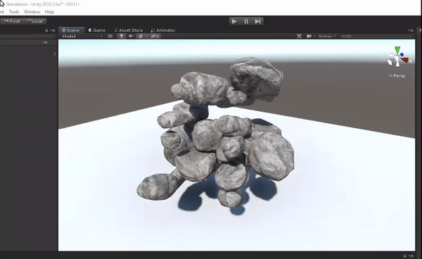
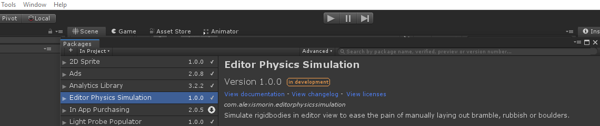

# Editor Physics Simulation
## Simulate Physics in the Unity Scene view.

This minimalist Unity package allows you to simulate physics in Scene view to ease the pain of manually laying out bramble, rubbish or boulders. No script or prefab finicking is required, just start and stop the simulation as you please. If you're more familiar with Unreal Engine, this package is roughly what the the *Simulate* button does.

### Usage
Inside the *Tools* menu item dropdown, you'll now find two new buttons: *Simulate Physics in Editor - Start* and *Simulate Physics in Editor - Stop* - these are pretty self explanatory, just make sure to stop the simulation when you're done!

### Install process
This is a plugin that makes use of Unity's new *Package Manager* feature. Just drop the *com.alexismorin.editorphysicssimulation* folder into your *packages* folder (found at the same level as your Assets folder) and it should work out-of-the-box. If you're using an older version of Unity, navigate inside the *com.alexismorin.editorphysicssimulation* folder and then just drag the *Editor* folder you find there anywhere in your project hierarchy.

